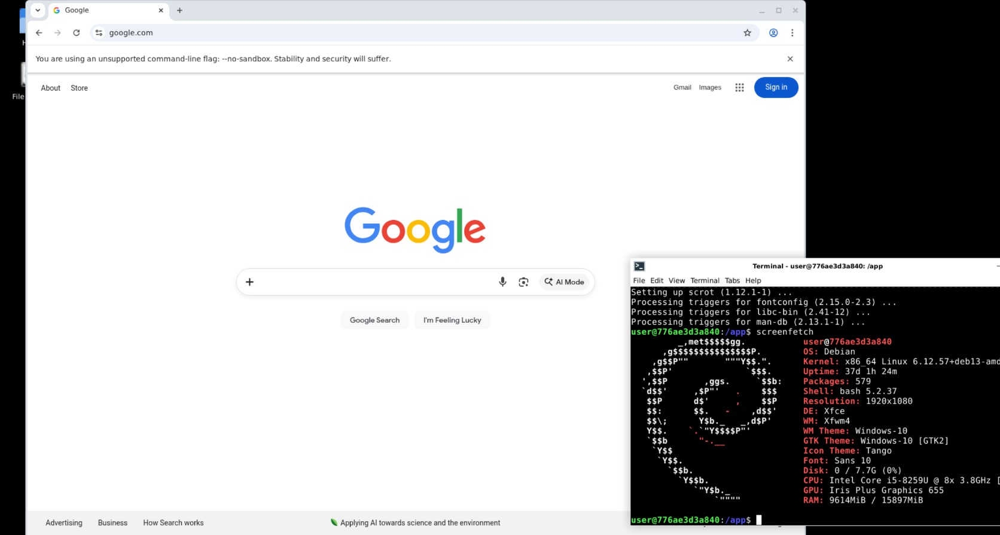

# Chrome Live



Run a containerized Google Chrome on Linux, accessible from any web browser.

Try using Docker:

```
docker run --name chrome-live -p 7000:80 ghcr.io/remotebrowser/chrome-live
```

or Podman:

```
podman run --name chrome-live -p 7000:80 ghcr.io/remotebrowser/chrome-live
```

Then open `localhost:7000` in your browser.

To enable remote control of Chrome via the [Chrome DevTools Protocol](https://chromedevtools.github.io/devtools-protocol/), map port 9222 as well:

```
podman run --name chrome-live -p 7000:80 -p 9222:9222 ghcr.io/remotebrowser/chrome-live
```

Configure Chrome's proxy connection using [Tinyproxy](https://tinyproxy.github.io) (refer to the sample `tinyproxy.conf`).

To allow specific domains, add them to `allowlist.txt` (one domain per line).

To test the CDP connection:

```
curl http://127.0.0.1:9222/json/list
```

To build and run locally:

```
docker build -t chrome-live .
docker run -p 7000:80 chrome-live
```

To deploy to [Fly.io](https://fly.io)

```
fly apps create test-chrome-live
fly deploy --ha=false -a test-chrome-live

# test CDP connection
FLY_IP=$(fly ips list -a test-chrome-live --json | jq -r '.[] | select(.Type=="v4") | .Address')
curl http://$FLY_IP:9222/json/list
```

## Provider startup benchmarks

Measured cold-boot and resume latency for chrome-live on several hosting
providers, with a recommendation for which orchestration approach (direct spawn
vs pre-warmed pool) fits each.

- Aggregated results and ranking: [bench/REPORT.md](bench/REPORT.md)
- Harness layout, credentials, and reproduction steps: [bench/README.md](bench/README.md)
